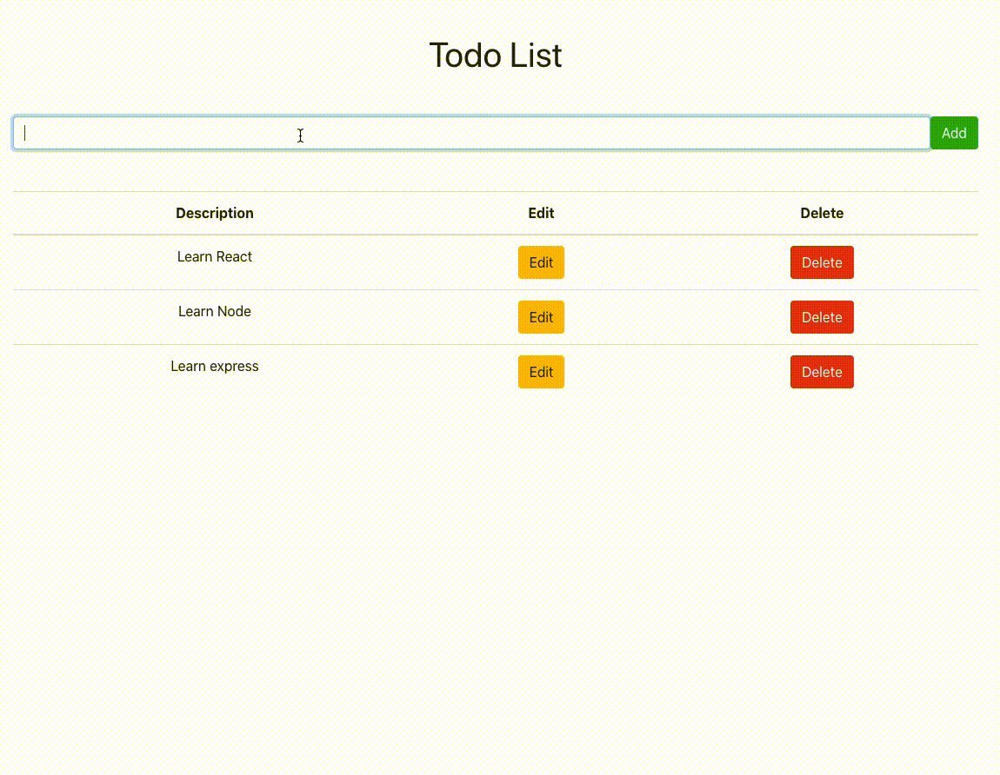

# Node Todo App

Simple app to practice using Node Postgres and Express to build a CRUD api using [freeCodeCamp tutorial](https://www.youtube.com/watch?v=ldYcgPKEZC8)

## Notes on process

This project was use to gain an understanding of React, Bootstrap, Node and Express. TDD hasn't been followed

## Run instructions

Fork, Clone, and cd into the repo
Install Node.js and npm

Get the project's dependencies
```npm install ```

To run the server
```
cd server
nodemon index
```
To run the client
```npm start```

## How the application works

